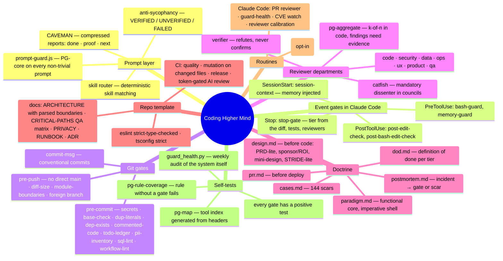
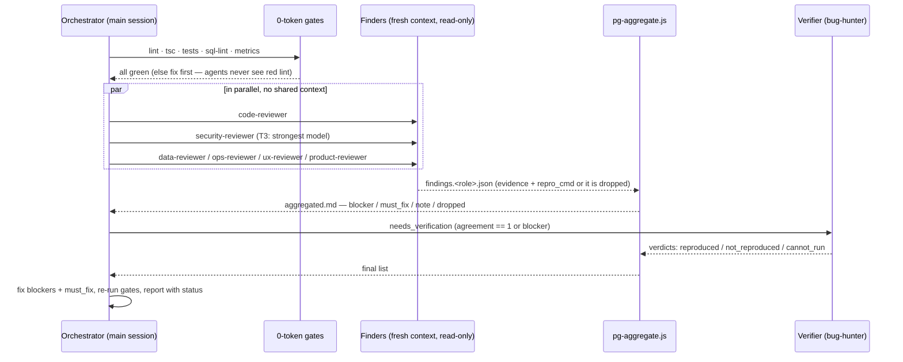
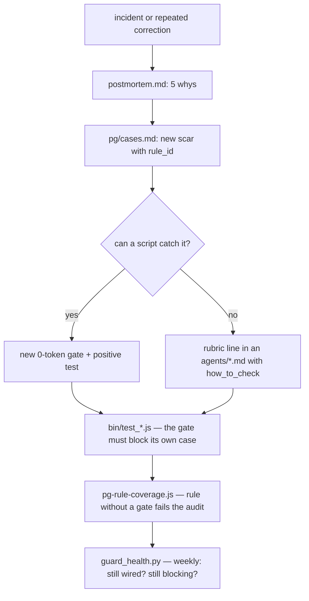

# Architecture — how the whole system works in the background

One person, two agent runtimes, ~40 repositories. Direction flows down; evidence flows back up. Nothing reaches
production without passing the gate band, and nothing is called "done" without a cited artifact.

## The whole machine on one map

## The life of one change

```mermaid
flowchart LR
  P[prompt] -->|prompt-guard.js<br/>protocol injected| E[edit]
  E -->|post-edit-check.js<br/>lint + types| S[session end]
  S -->|stop-gate.js<br/>tier from diff<br/>tests green<br/>T2+: reviewers| C[git commit]
  C -->|pre-commit<br/>secrets · base · dups · deps<br/>SQL · workflows · PII · TODO| U[git push]
  U -->|pre-push<br/>no main · size · boundaries| PR[pull request]
  PR -->|CI from template<br/>quality · mutation · gitleaks| M[merge]
  M -->|mas_merge_prs.py<br/>only on current merge-ref| D[deploy]
  D -->|wait_prod_multi.py<br/>200 from the real domain| L((LIVE))
  classDef gate fill:#fff3cd,stroke:#b58105,color:#111;
  class P,E,S,C,U,PR,M,D gate;
```

Every arrow is a gate that can say no. Every "no" is either fixed or overridden with a named env var (`ALLOW_*=1`)
that is logged and shows up in the weekly audit.

## Risk tier — computed, never declared

`hooks/lib/risk-tier.js` reads the changed paths and the diff size:

| Tier | Signal | Consequence at session end |
|---|---|---|
| T0 | docs, copy, assets | zero-token gates only |
| T1 | isolated component / util | code-reviewer recommended |
| T2 | shared logic, routes, edge functions, dependencies, CI, > 150 lines | code + ops (+ ux / data) required — the session does not close without them |
| T3 | auth, RLS, payments, secrets, migrations, cron, admin, > 600 lines | code + security + data + ops (+ ux) → verifier on the strongest model |

Per-repo floors and ceilings: `pg.tier_floor`, `pg.phase` (a prototype is capped at T1; promotion to production needs a
production-readiness review in the same commit).

## Review as a software house, not as a chat

Why this shape: a single "super-reviewer" skips roles; agents that chat converge on the majority even when the minority
was right (multi-agent failure taxonomies); aggregation in code has no opinion. The **catfish** role exists for
councils because injected dissent is the one intervention that measurably cuts quiet-agreement failures.

## Scar → gate — the loop that makes the system learn

144 scars today. Examples of gates born from scars: green checks on a stale merge-ref that broke `main` → merge only on
the current merge-ref + strict branch protection; a hook that consumed stdin twice and never ran for six days → every git
hook has a test that runs the whole script with stdin; 45 copies of a company identity across 11 files, all of which
passed lint, types, tests and review → duplicate-literal gate on added lines; a fallback that silently changed the seller
on an invoice → SILENT-FALLBACK is a blocker on any field with consequences.

## Two runtimes, one system

| | Claude Code (terminal) | Claude Desktop / Cowork |
|---|---|---|
| Work | repositories, CI, production apps | mail, documents, research, operations |
| Enforcement | hooks + git gates + CI | the verification protocol as text in every prompt |
| Memory | `session-context.js` injects the same notes at session start | notes maintained by routines (sessions → notes, weekly organiser) |
| Secrets | a secret manager injects env vars into the target process; `bash-guard.js` blocks secrets typed into commands | same manager, no hooks |
| Routines | PR reviewer, guard health, CVE watch, reviewer calibration | watchdog, backup + restore script, weekly report, self-evolution (opt-in) |

## Where the numbers come from

Everything countable is counted by a script at export time (`bin/pg-map.py`, `guard_health.py`, `bin/mine_sessions.py`,
`bin/mine_git.py`): files, tools, tests, scars, gate skips per reason, corrections per session, fixes within 24 h of the
previous commit to the same file. The retro in `pg/retro-2026-09-06.md` shows what those numbers looked like before and
after the gates — including the finding that started all of this: 79 % of commits went straight to `main`, and three of
twelve repair loops in one session were the same defect — *the system declared a control it physically did not have*.
