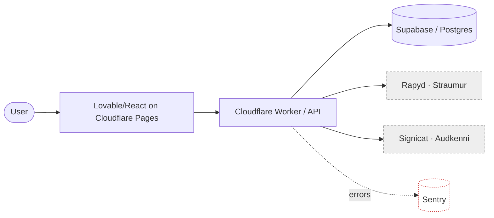

# Deliverable templates

Four outputs. Use the ones the mode calls for; offer the rest. The point of every template is
to make the **trade-off and its context explicit and durable** — so a decision can be revisited
later against the reasoning that produced it, not re-argued from scratch.

For anything substantial, write the deliverable to a real file in the outputs folder (Markdown
by default; offer `.docx`/`.pdf` via the docx/pdf skills for client-facing versions) rather than
only printing it in chat.

---

## A. Architecture Decision Record (ADR)

One ADR per significant decision. Short, plain, honest about what's being given up. The
**Trade-offs accepted** and **Revisit when** sections are the ones people skip and most need.

```markdown
# ADR-<NNN>: <short decision title>

- **Status:** Proposed | Accepted | Superseded by ADR-XXX
- **Date:** <YYYY-MM-DD>
- **Context tags:** <team size · scale · certainty · criticality — the forces that decided this>

## Context
<The situation and the 2–4 real constraints that actually matter here. What makes this
decision live now. No solution yet — just the forces.>

## Decision
<The choice, stated plainly. The simplest option that satisfies the constraints above.>

## Trade-offs accepted
<What we are consciously giving up. The honest cost — complexity, lock-in, ops burden, a
capability deferred. If this section is empty, you haven't found the real trade-off yet.>

## Alternatives considered & rejected
- **<Option>** — rejected because <reason in this context> (not "bad", but "wrong here").
- **<Option>** — …

## Consequences
<What becomes easier, what becomes harder, what we now have to maintain or watch.>

## Revisit when
<The concrete future signal that should reopen this decision — a scale threshold, a second
team, a new compliance need. This is how we avoid both premature complexity now and
out-of-date simplicity later.>
```

---

## B. Trade-off scorecard

For SELECT (comparing options) and AUDIT (rating findings). Weight criteria by the **real
constraints** from the context interview — an honest scorecard is weighted by *this* project's
forces, not generic ones. Make costs visible columns, never hide them in a total.

**SELECT — comparing options:**

```markdown
## Decision: <what we're choosing>
Weighted by what matters here: <e.g. changeability ×3, time-to-ship ×3, scale-headroom ×1, ops-simplicity ×2>

| Criterion (weight) | Option A: <simple default> | Option B: <…> | Option C: <…> |
|---|---|---|---|
| Fit to real constraints | | | |
| Time to ship | | | |
| Complexity / ops burden (lower = better) | | | |
| Maintainability (3am test) | | | |
| Cost ($ + lock-in) | | | |
| Scale headroom | | | |
| **Weighted read** | | | |

**Recommendation:** <option> — because <the 1–2 constraints that decided it>.
**What we're deliberately NOT doing:** <deferred complexity> — see roadmap "Not yet".
```

**AUDIT — findings:**

```markdown
| # | Finding | Type | Severity | Effort | Priority |
|---|---|---|---|---|---|
| 1 | <e.g. payment webhook not idempotent> | Under-eng / risk | High | Low | Do now |
| 2 | <e.g. microservices split for a 2-person app> | Over-eng | Med | High | Plan / accept |
| 3 | <e.g. no Sentry despite it being in the stack> | Under-eng / risk | Med | Low | Do now |
| 4 | <e.g. single Postgres, no cache> | (none) | — | — | Leave it — correct for scale |

- **Type:** Over-engineering (unearned complexity) · Under-engineering/risk (unmet present constraint) · OK (call it out — a clean finding is valuable).
- **Severity** = pain it causes now. **Effort** = cost to change. **Priority** ≈ severity ÷ effort. High-severity/low-effort first; never recommend change with no severity behind it.
```

---

## C. Architecture diagram (Mermaid)

Diagrams make the structure legible and the failure points visible. Default to **Mermaid** (the
`diagrams` skill can render/refine it). Show data stores, external dependencies, and trust/
network boundaries — those are where complexity and failure concentrate. For AUDIT, annotate the
problem spots; for EVOLVE, show current vs target.



Conventions: solid arrows = synchronous calls; dashed = async/events/telemetry; `[(...)]` =
datastore; `:::ext` = third party you don't control (each is a failure mode to handle);
group with `subgraph` to show a deploy/trust boundary. For AUDIT add a `%% RISK:` note or a red
class on the node that's over/under-engineered.

---

## D. Evolution roadmap

The roadmap's job is to stage complexity so each piece arrives exactly when its constraint does
— and to make the **Not yet** list explicit, because telling someone what not to build yet is
often the highest-value output here.

```markdown
# Evolution roadmap: <system>

## Now (pain is real today)
- **<change>** — relieves <current pain>. Cost: <effort>. Migration: <path>. → ADR-<NN>.

## Soon (trigger is approaching)
- **<change>** — **Trigger:** <measurable signal, e.g. "p95 > 800ms" / "2nd team onboarding" / "table > 10M rows">. Cost: <effort>. Until then: leave as-is.

## Later (plausible, not pressing)
- **<change>** — **Trigger:** <signal>. Revisit when it fires; ignore until then.

## Not yet — deliberately deferred
- **<tempting upgrade, e.g. microservices / event bus / k8s / multi-region>** — **Don't build until:** <the specific condition that would justify it>. Doing it now buys complexity with no present payoff.
```

Sequence by dependency (what unblocks what) and by pain relieved (worst first). Every item past
"Now" carries a **trigger** — the signal that converts "not yet" into "now". A roadmap without
triggers is just a wishlist.

---

## Matching deliverables to modes

- **SELECT** → Scorecard (options) + ADR(s) for the decisions made + target diagram + the deferred items seeded into a roadmap's "Soon/Later/Not yet".
- **AUDIT** → Current-state diagram (annotated) + findings scorecard + an ADR per change worth making. If changes are sequential, add a roadmap.
- **EVOLVE** → Roadmap (primary) + ADR(s) for the "Now" items + current-vs-target diagram.

Lead with the recommendation and the one or two constraints behind it; attach the artifacts.
Don't bury the decision under documentation — the document serves the decision, not the reverse.
