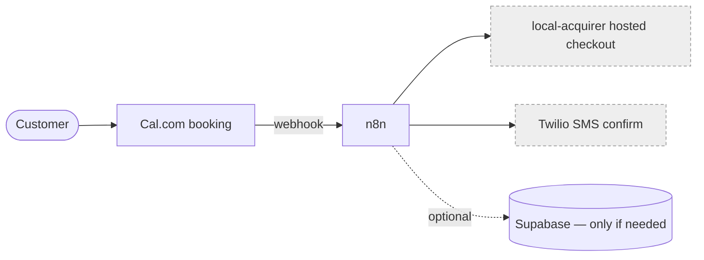

# Worked examples

Two short runs showing how the reasoning and the deliverables come together. The point is the
*shape* of a good run — context → the few constraints that matter → reversibility triage →
the simplest fitting design → trade-offs made explicit, with paperwork only where it's earned.
Don't copy the specifics; copy the discipline.

---

## Example 1 — SELECT: "project-c wants online booking + a deposit"

**Request:** *"I want customers to book a handyman slot online and pay a deposit so they don't no-show."*

### Step 1 — Context (inferred first, then one question)
Inferred from the project-c context: solo/tiny operator, Reykjavík, low volume (a handful of
bookings/day at most), this is a *new* feature validating demand (uncertain), and the operator —
not a dev team — lives with whatever is built. One load-bearing unknown actually moves the
design, so ask only that: **"Is the deposit a fixed ISK amount taken now, and is it refundable?"**
Everything else can be inferred or is reversible.

### Step 2 — The constraints that actually matter (2–4, not ten)
1. **It takes money in ISK** — payments + storing who-paid-what. This is the one serious constraint.
2. **Very low volume, uncertain demand** — don't build anything heavy; it may change or be dropped.
3. **Solo, non-technical maintainer** — managed services only; nothing to operate or debug at 3am.

### Step 3 — Reversibility triage (decide what deserves depth)
- **One-way door (go deep):** the **payment processor** and where money/PII is stored. Switching processors later means re-integrating and migrating; touching card data wrong creates compliance liability. → full trade-off + ADR.
- **Two-way doors (decide in one line each):** booking calendar tool, notification channel, the page itself. Reversible, low stakes → pick the obvious option, no ceremony.

### Step 4 — Recommendation (simplest design that fits)
- **Booking:** integrate **Cal.com** — don't build a calendar/availability engine (commodity, two-way door).
- **Deposit:** **local-acquirer** hosted checkout for domestic ISK; project-c never touches card data (stays out of PCI scope). This is the decision that got the full analysis — see ADR below.
- **Glue & notifications:** **n8n** workflow on the booking webhook → confirmation **SMS via Twilio** → log the booking. Add **Supabase** *only if* bookings need to live somewhere beyond Cal.com; for now, Cal.com + n8n is enough.
- **No backend, no app, no custom payment flow, no microservices.** Stated explicitly so the deferral is a recorded decision, not an omission.

### Step 5 — Deliverables (proportional: one ADR for the one-way door, one-liners for the rest)

**Mini scorecard — payment processor** (weighted by: ISK-domestic ×3, low fees ×2, integration simplicity ×2, no PCI scope ×3):

| Criterion | local-acquirer | payment-gateway | Stripe |
|---|---|---|---|
| ISK domestic | best | ok | weak/indirect |
| Fees on small ISK deposits | low | med | med |
| Hosted checkout (no PCI) | yes | yes | yes |
| Integration simplicity (solo) | simple | heavier | heavier |
| **Read** | **pick** | overkill now | overkill now |

**ADR (the one-way door):**
```
# ADR-001: Take the project-c booking deposit via local-acquirer hosted checkout
- Status: Accepted   - Date: 2026-06-15
- Context tags: solo operator · very low volume · uncertain demand · takes ISK · GDPR/PII

## Context
project-c needs a refundable ISK deposit at booking to cut no-shows. Volume is low and the
feature is unproven. The operator is non-technical. Payments and personal data are the only
hard-to-reverse parts of this; everything else is trivially changeable.

## Decision
Use local-acquirer's hosted checkout for the deposit. Card data never touches project-c systems.
Booking handled by Cal.com; n8n + Twilio for confirmation. No custom backend yet.

## Trade-offs accepted
Tied to local-acquirer for now (migrating processors later is real work). Cal.com + local-acquirer are two
separate tools rather than one unified flow — accepted for the simplicity and zero PCI scope.

## Alternatives rejected
- payment-gateway / Stripe — fine processors, but heavier integration and no advantage for low-volume
  domestic ISK today. Reconsider if going international or adding subscriptions.
- Custom payment integration — rejected: pulls project-c into PCI scope for zero benefit.

## Consequences
Easier: live in days, nothing to operate. Harder: two tools to reconcile; refunds handled in
local-acquirer. Maintain: one n8n workflow, one Twilio number.

## Revisit when
Volume passes ~15–20 bookings/day, recurring/subscription billing is needed, or project-c
expands outside Iceland — then reassess processor and whether bookings need Supabase.
```

**Diagram:**


**Note the proportionality:** four components, one ADR. The booking tool, SMS channel, and
"maybe Supabase later" each got a single sentence because they're reversible. Only the
money/identity decision earned the full treatment.

---

## Example 2 — AUDIT: "Is my local-acquirer payment-webhook automation any good?"

**What reading the n8n JSON + the worker reveals:** a single 40-node n8n workflow that (a)
receives local-acquirer webhooks, (b) emails receipts, and (c) syncs a spreadsheet — three unrelated
jobs in one canvas. The webhook node does the spreadsheet sync *inline* before responding. No
dedupe on the local-acquirer event id. No Sentry. Secrets are in n8n credentials (good).

**Findings scorecard:**

| # | Finding | Type | Severity | Effort | Priority |
|---|---|---|---|---|---|
| 1 | Webhook not idempotent — local-acquirer retries → double receipts / double sync | Under-eng / risk | High | Low | Do now |
| 2 | Slow spreadsheet sync runs *inside* the webhook response path → timeouts → more retries | Under-eng / risk | High | Med | Do now |
| 3 | No error monitoring; a failed run is silent (Sentry is in the stack) | Under-eng / risk | Med | Low | Do now |
| 4 | One 40-node workflow doing 3 jobs → fragile, hard to change | Over-eng (maintainability) | Med | Med | Plan |
| 5 | Secrets in n8n credentials, not hardcoded | OK | — | — | Leave it — correct |

**Verdict & next step (AUDIT flows into EVOLVE):** Now — dedupe on `event_id`, respond 200
immediately and move the sync to a downstream branch, add Sentry. Soon — split the one workflow
into three single-purpose flows (trigger when the next change to it feels risky). Not yet — a
custom payments service or a queue: volume doesn't justify either; revisit only if webhook
volume becomes spiky or the spreadsheet sync grows into real reporting.

One ADR (idempotency) carries the highest-severity fix; the rest are short. Notice the audit
also says **what to leave alone** — a clean finding is a real finding.
