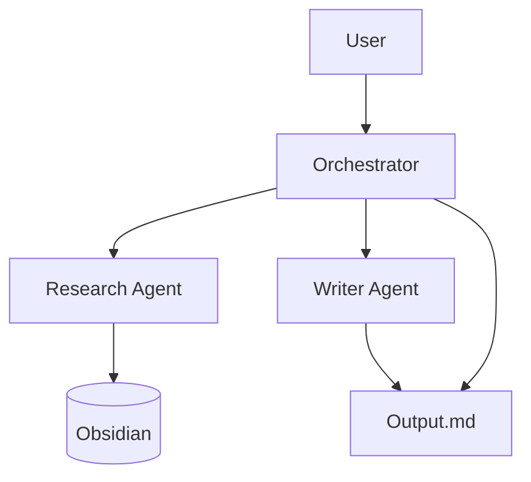
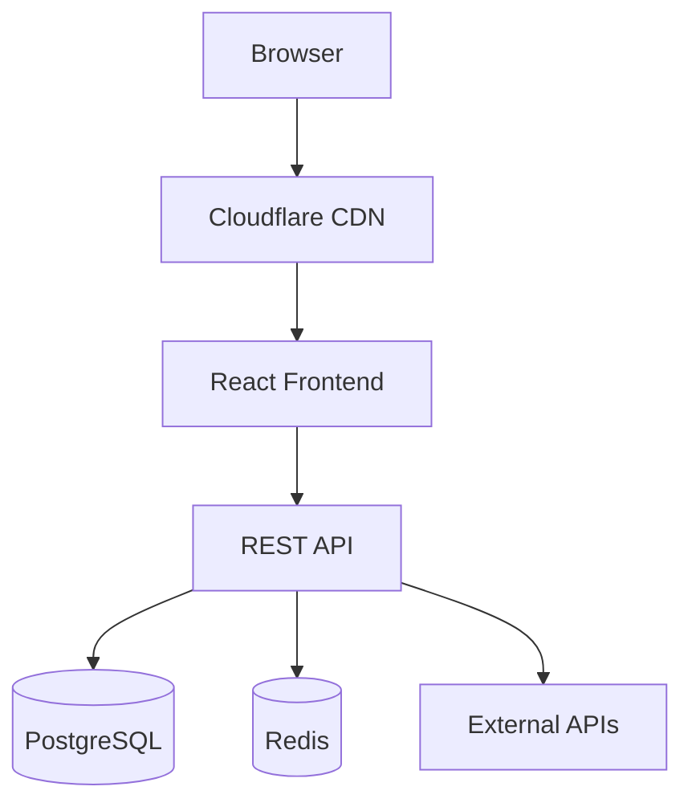

# Architecture Diagrams

When working on systems, diagrams communicate structure faster than any description. This skill generates them automatically and keeps them updated as the system evolves.

## Two-tier approach

### Tier 1: Mermaid (in-chat, instant)

Use for quick diagrams shown directly in the conversation. No install needed, renders immediately in Cowork and Claude.

Always generate Mermaid first - it's zero friction and gives uzytkownik an immediate visual.

**Diagram types:**

- `graph TD` - component architecture, service connections, dependency trees
- `sequenceDiagram` - request/response flows, API calls, agent handoffs
- `erDiagram` - data models, database schemas
- `flowchart LR` - process flows, decision trees
- `C4Context` - system context maps (what talks to what at high level)

**Example - agent pipeline:**


**Example - web system:**


### Tier 2: `diagrams` Python library (saved PNG)

Use when the system is substantial and uzytkownik will want to reference the diagram later, share it, or include it in a doc/prompt.

**Install once (if not already installed):**
```bash
pip install diagrams --break-system-packages
# Mac: brew install graphviz
# Linux: apt install graphviz
```

Generates proper architecture PNGs with provider icons (AWS, GCP, Azure, generic, on-prem, k8s).

Save to outputs folder. Name clearly: `[project]-architecture.png`.

**Example:**
```python
from diagrams import Diagram, Cluster
from diagrams.onprem.client import User
from diagrams.generic.compute import Rack
from diagrams.generic.storage import Storage
from diagrams.generic.network import Router

with Diagram("Project Architecture", filename="outputs/project-architecture", show=False, direction="LR"):
    user = User("uzytkownik")
    with Cluster("Backend"):
        api = Rack("API Server")
        db = Storage("Database")
        cache = Storage("Cache")
    user >> api
    api >> db
    api >> cache
```

Available icon sets: `diagrams.aws.*`, `diagrams.gcp.*`, `diagrams.azure.*`, `diagrams.onprem.*`, `diagrams.generic.*`, `diagrams.k8s.*`, `diagrams.saas.*`. Use the set that matches the actual tech stack.

---

## When to generate / update

| Situation | Action |
|-----------|--------|
| Starting system design | Mermaid immediately + PNG if complex |
| Adding a new component or service | Update existing diagram |
| Changing how data flows | Update diagram to reflect new flow |
| Debugging an architecture problem | Annotate with problem area |
| Writing a Lovable prompt for a client site | Include site structure diagram |
| Building an MCP server | Diagram: tool -> service -> API connections |
| Planning an agent pipeline | Diagram: agents, tools, data stores |
| Connecting external APIs/services | Diagram: integration map |
| Any "how does X connect to Y" question | Draw it, don't describe it |

## Update rule

If a diagram already exists for a system being worked on, **update it** - don't let it go stale. Regenerate the PNG with each structural change and note what changed.

Track the diagram file path so it can be referenced again later in the same project.

---

## Diagram quality rules

- **One diagram per system** - don't fragment into 5 tiny diagrams, keep it unified
- **Label edges** - if a connection has a protocol, method, or data type, label it (`-> REST`, `-> webhook`, `-> writes`)
- **Group with clusters** - use `Cluster` or `subgraph` to show logical boundaries (frontend / backend / external)
- **Direction matters** - `TD` (top-down) for hierarchies, `LR` (left-right) for pipelines/flows
- **Keep it current** - a stale diagram is worse than no diagram

---

## Integration with other skills

This skill works alongside:
- **caveman-code** - diagrams generated in caveman coding sessions
- **lovable-build** - site structure diagrams included in Lovable prompts
- **mcp-builder** - tool/service connection maps for MCP servers
- **tech-stack** - infrastructure and integration maps for the company
- **agency-site** - client project architecture for agency-site builds

In any of these contexts, generate diagrams proactively without waiting to be asked.
