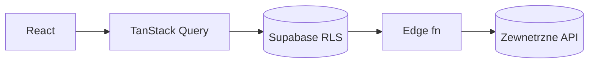

# ARCHITECTURE — mapa dla obcego (1 strona)

<!-- Cel: senior, ktory nigdy nie widzial repo, znajduje miejsce zmiany w 15 min. Aktualizuj przy kazdym ADR. -->

## Co to jest (3 zdania)
- Dla kogo, jaki problem, jaki model biznesowy (kto placi).

## Stack (boring, z wersjami — z package.json)
- Frontend: … · Backend/DB: … · Hosting: Vercel / Lovable (edge fn NIE deployuja sie z git push) · Platnosci: … · Mail/SMS: …

## Moduly i granice (co jest gdzie)
| Katalog | Odpowiedzialnosc | Wejscie (public API) | Tier |
|---|---|---|---|
| `src/features/<x>` | … | `index.ts` | T2 |
| `src/lib/<y>` | czyste funkcje domenowe (bez I/O) | … | T1 |
| `supabase/migrations` | schemat + RLS | — | T3 |
| `supabase/functions` | edge fn (Deno) | HTTP | T3 |

## Granice modulow — zalozenia ZAPISANE i egzekwowane (parsowane)

<!-- Blok ponizej czyta `node ~/.claude/bin/module-boundaries.js` (pre-push): warstwy od gory do dolu — plik z warstwy wyzej
     moze importowac warstwe nizej, nigdy odwrotnie; `forbid` = jawne zakazy; NOWY cykl importow = blok. To jest miejsce na
     „niepisane zalozenia architektoniczne" — jesli nie ma ich tutaj, kazdy kolejny diff moze je zlamac i nikt tego nie zobaczy. -->

```json
{
  "pg.boundaries": true,
  "layers": ["src/routes", "src/features", "src/components", "src/lib"],
  "forbid": [
    { "from": "src/lib", "to": "src/integrations", "why": "functional core bez I/O: lib nie zna Supabase/fetch" }
  ],
  "maxFanIn": 40
}
```

## Przeplyw danych (diagram)


## Gdzie jest…
- autoryzacja: … (RLS + `org_id`)  · ceny/kwoty: … · i18n: … · logi: … · feature flagi: … · sekrety: env/Infisical

## Decyzje nieodwracalne
Lista ADR: `docs/adr/` (kazdy z „dlaczego" i odrzucona alternatywa).

## Jak to cofnac / kill switch
- …
